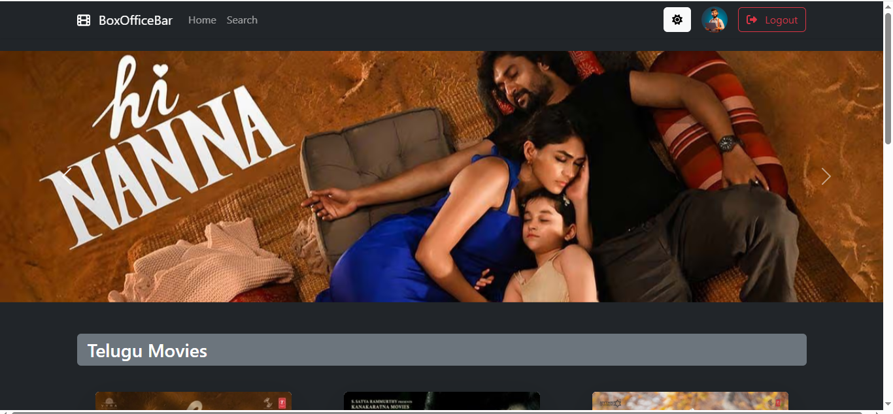
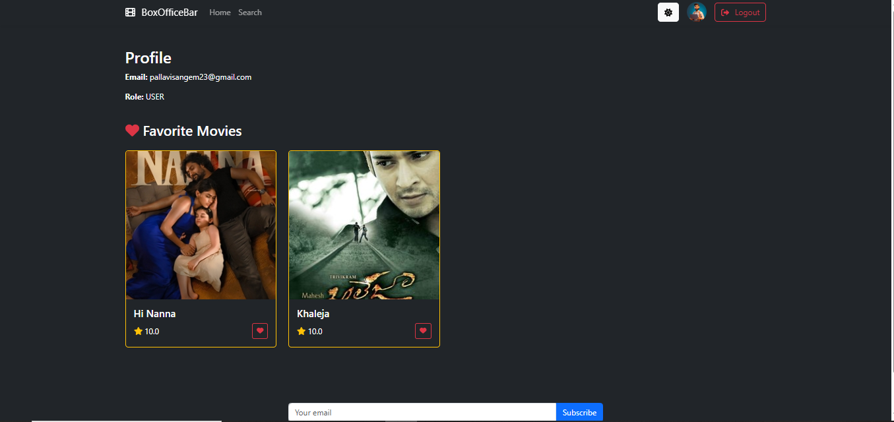
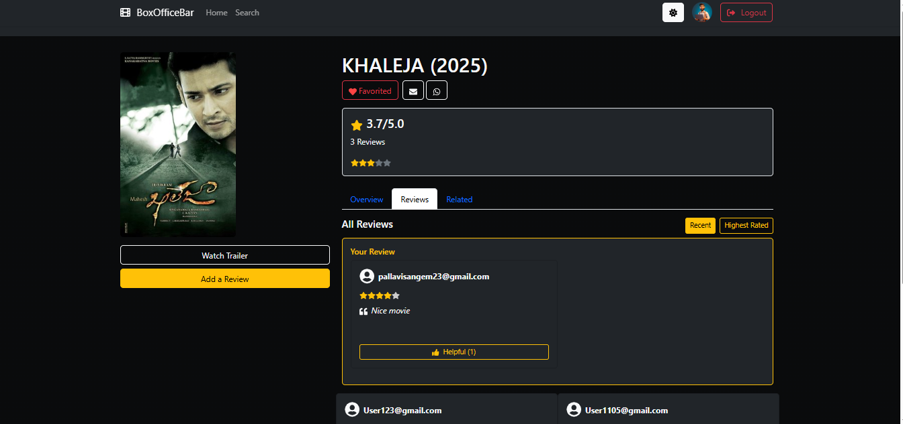
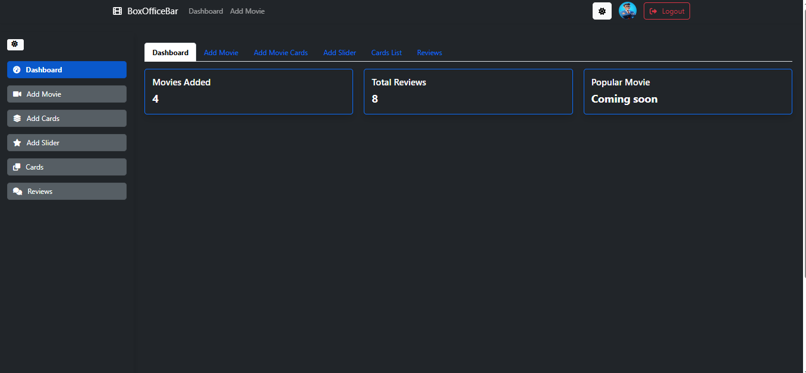
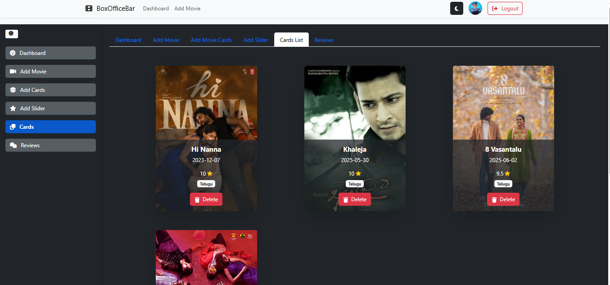

# 🎬 Movie Rating and Review System

A full-stack web application that allows users to browse, rate, and review movies. It features **JWT-based authentication**, **role-based access control**, personalized user profiles, search and filter functionality, and a management dashboard for users with elevated access.

---

## 🚀 Features

- 🔐 JWT-based login and registration
- 👥 Role-based access (user & reviewer)
- ⭐ Submit and manage movie reviews
- ❤️ Favorite movies feature
- 🔍 Search and filter by genre, rating, and year
- 🧑‍💻 Profile management for users
- 📊 Reviewer dashboard with full CRUD operations
- 📱 Responsive UI with Bootstrap

---

## 🛠️ Tech Stack

| Layer       | Technologies                  |
|-------------|-------------------------------|
| Frontend    | React, Bootstrap              |
| Backend     | Java, Spring Boot             |
| Database    | MySQL                         |
| Auth        | JWT (JSON Web Tokens)         |
| Tools       | Postman (API testing), GitHub |

---

## 📸 Screenshots
User



admin


## 🏁 Getting Started

Follow these steps to run the project locally on your system.

### 🔧 Prerequisites

Make sure the following tools are installed:

- [Java 17+](https://www.oracle.com/java/technologies/javase/jdk17-archive-downloads.html)
- [Maven](https://maven.apache.org/install.html)
- [MySQL Server](https://dev.mysql.com/downloads/installer/)
- [Node.js & npm](https://nodejs.org/)
- Git

---

### 🛠️ Backend Setup (Spring Boot)

1. Open terminal and navigate to the backend directory:
   ```bash
   cd movieapi
2. Update application.properties with your MySQL credentials.

3. Create a database:
CREATE DATABASE moviedb;
4. Run the backend:
mvn clean install
mvn spring-boot:run
Backend runs at: http://localhost:8080

🔹 Step 2: Frontend Setup (React)
1. Navigate to the frontend directory:
cd movie-rating
2.Install and start:
npm install
npm start
Frontend runs at: http://localhost:3000

✅ You’re all set! Log in or register to start exploring movies.
